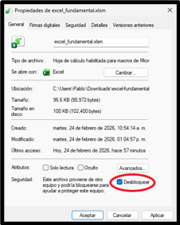

# Excel Fundamental 2.0 — Uso General

Excel Fundamental es un programa que integra modelos termodinámicos en Microsoft Excel.  
Está diseñado para evaluar estos modelos de forma vectorizada, permitiendo realizar cálculos eficientes directamente sobre tablas de Excel.

Incluye una base de datos con propiedades termodinámicas de 468 compuestos químicos.  
Los modelos pueden utilizarse directamente para los compuestos disponibles sin necesidad de ingresar manualmente sus propiedades.

---

# Instalación del programa

La instalación consta de tres partes:

1. Instalar Python  
2. Instalar las librerías necesarias  
3. Descargar y preparar el archivo de Excel  

---

## 1. Instalar Python

Descarga Python desde el sitio oficial:

https://www.python.org/

Durante la instalación aparecerá la siguiente casilla:


Es importante que la actives.  
Esto permite usar Python desde la terminal de Windows.

---

## 2. Instalar librerías de Python

Excel Fundamental utiliza:

- **NumPy** para los cálculos numéricos  
- **xlwings** para la conexión con Excel  

Estas librerías deben instalarse manualmente.

### Abrir la terminal

1. Haz clic en la pestaña **Buscar** de Windows.


2. Escribe `Terminal`.


3. Haz clic en la aplicación.

---

### Instalar NumPy

En la terminal escribe:

```bash
pip install numpy
```

Presiona Enter y espera a que termine la instalación.

---

### Instalar xlwings

Después, escribe:

```bash
pip install xlwings
```

Presiona Enter y espera a que termine.

---

## 3. Instalar Excel Fundamental

### Descargar el repositorio

Ingresa al siguiente enlace:

https://github.com/pablo-vroch/excel-fundamental

Haz clic en el botón verde **Code**.


Luego selecciona **Download ZIP**.


---

### Extraer los archivos

Haz clic derecho en el archivo:

`excel-fundamental-main.zip`

Selecciona **Extraer todo**.


---

### Abrir la aplicación

Ingresa a la carpeta:

`excel_fundamental_app`


Haz clic derecho en el archivo:

`excel_fundamental.xlsm`

Selecciona **Propiedades**.


Marca la casilla **Desbloquear** y haz clic en **Aplicar**.



Ahora puedes abrir el archivo normalmente.
